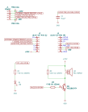

The Internet PCB
================

Overview
--------

PCB to power an ESP32-C3 connected to an LED and a piezoelectric buzzer.

Dimensions: 88mm W × 40mm H

Purpose
-------

Use an ESP32-C3 in a small black rectangular plastic box (Maplin BZ74R) to make
a remotely controllable "The Internet" with a flashing red LED on top.

Include the `Wireless 3.3V Supercapacitor PCB <https://github.com/nomis/wireless-3v3-supercap-pcb>`_
for wireless power, because "The Internet" is wireless.

Place on top of `Big Ben <https://en.wikipedia.org/wiki/Big_Ben>`_ for the best
reception and don't forget to degauss it regularly.

Usage
-----

This is a KiCad project.

Schematics
----------

PCB
---

.. image:: render/the-internet-pcb.svg
   :alt: PCB

Components
----------

+---------------------+----------+--------------------------------------------------------------+
| Refs                | Quantity | Name                                                         |
+=====================+==========+==============================================================+
| J1                  |     1    | 1x06 Pin Header, Through Hole (2.54mm)                       |
+---------------------+----------+--------------------------------------------------------------+
| J2, J3              |     2    | 1x08 Pin Socket, Through Hole (2.54mm)                       |
+---------------------+----------+--------------------------------------------------------------+
| BZ1                 |     1    | TDK PS1720P02 Piezo Buzzer 3V 2kHz 70dB, Through Hole (17mm) |
+---------------------+----------+--------------------------------------------------------------+
| C1                  |     1    | 0.1µF Capacitor, SMD 0805 (Metric 2012)                      |                                                      |
+---------------------+----------+--------------------------------------------------------------+
| D1                  |     1    |                                                              |
+---------------------+----------+--------------------------------------------------------------+
| Q1, Q2              |     2    | Diodes DMP2004K P-Channel MOSFET, SOT-23                     |
+---------------------+----------+--------------------------------------------------------------+
| R1                  |     1    | 47Ω 1% 0.5mW Resistor, SMD 1206 (Metric 3216)                |
+---------------------+----------+--------------------------------------------------------------+
| R2                  |     1    |                                                              |
+---------------------+----------+--------------------------------------------------------------+
